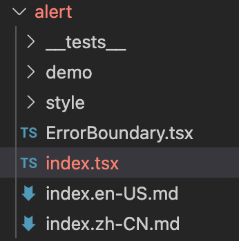

# Ant Design 101: Starting with Alert

Understanding and learning how to design and implement UI component libraries

**[Alert component documentation](https://ant.design/components/alert/)**. Alert is a good place to start as one of the simplest components.


## 1. Project structure



\_\_tests__: test-related code

## 2. Preparation

1. **Index.tsx**

   Alert component has only one file index.tsx: <u>component implementation</u> and <u>export</u> are done in this file.

2. **import section**

   ```typescript
   import * as React from 'react';
   // icons
   import CloseOutlined from '@ant-design/icons/CloseOutlined';
   ...
   import CloseCircleFilled from '@ant-design/icons/CloseCircleFilled';
   // Animation library
   import Animate from 'rc-animate';
   // A library for dynamically rendering class names
   import classNames from 'classnames';
   // use context
   import { ConfigContext } from '... /config-provider';
   import getDataOrAriaProps from '... /_util/getDataOrAriaProps';
   import ErrorBoundary from '. /ErrorBoundary';
   import { replaceElement } from '... /_util/reactNode';
   ```

   The first step is to introduce React, various icons, animation libraries and a third-party tool library `classnames`; the rest of the introduction will be discussed and explained below.

3. **Define the Props structure**

   ```typescript {17,18,19,20,23,24,25}
   export interface AlertProps {
     type?: 'success' | 'info' | 'warning' | 'error';
     closeable?: boolean;
     /** Close text to show */
     closeText?: React.ReactNode;
     /** Content of Alert */
     ReactNode; /* Content of Alert */ message: React;
     /** Additional content of Alert */
     ReactNode; /* Additional content of Alert */ description?: React;
     /** Callback when close Alert */
     MouseEventHandler<HTMLButtonElement>;
     /* Trigger when animation ending of Alert */
     afterClose?: () => void;
     /** Whether to show icon */
     showIcon?: boolean;
     /* */
     role?: string;
     style?: React.CSSProperties;
     prefixCls?: string;
     className?: string;
     banner?: boolean;
     icon?: React.ReactNode;
     onMouseEnter?: React.MouseEventHandler<HTMLDivElement>;
     onMouseLeave?: React.MouseEventHandler<HTMLDivElement>;
     onClick?: React.MouseEventHandler<HTMLDivElement>;
   }
   ```

   The meaning of all the values inside Props is straightforward, so I won't discuss them one by one here. However, please refer to **[Alert API](https://ant.design/components/alert/#API)** when looking at the structure of Props for easy understanding. Next, a few values that do not appear in the documentation.

   1. **style, className**: custom in-line style and class name
   2. **onMouseEnter, onMouseLeave, onClick**: several event hooks
   3. **prefixCls**: class name prefix. In AntDesign, the class name prefix defaults to ant-*. 4.
   4. **role**: According to [ARIA](https://www.w3.org/TR/2014/REC-html5-20141028/dom.html#aria-role-attribute), HTML elements should be marked with the role (function) they belong to. For example: `<hr/>` provides the function of `separator (split)`.

4. **Define Alert function component and mount ErrorBoundary component**

   Here the `ErrorBoundary` component appears, which is introduced at the beginning. Its role can be found in **[Alert ErrorBoundary documentation](https://ant.design/components/alert/#Alert.ErrorBoundary)**.

   ```typescript
   import ErrorBoundary from '. /ErrorBoundary';
   /* ... */
   interface AlertInterface extends React.FC<AlertProps> {
     ErrorBoundary: typeof ErrorBoundary;
   }
   const Alert: AlertInterface;
   /* ... */
   Alert.ErrorBoundary = ErrorBoundary;
   ```

   Here the `AlterInterface` interface is defined and inherited from `React. Its role is to mount`ErrorBoundary` to the Alert function component.

   ```jsx
   // Introduce
   const { ErrorBoundary } = Alert;
   // Use the
   <ErrorBoundary>
     <children />
   </ErrorBoundary>
   ```

5. **State HOOK**

   ```typescript
   /** Closing state: closing | closed */
   const [closing, setClosing] = React.useState(false);
   const [closed, setClosed] = React.useState(false);
   ```

6. **Ref HOOK & Mounted Elements**

   ```tsx
   // Create a ref for the HTML element
   const ref = React.useRef<HTMLElement>();
   // Mounted on the element
   <div ref={ref} ... ></div>
   ```

7. **Get the configuration items distributed by ConfigProvider**

   ```typescript
   const { getPrefixCls, direction } = React.useContext(ConfigContext);
   // prefixCls defaults to ant-* when there is no custom prefix, i.e. ant-alert.
   const prefixCls = getPrefixCls('alert', customizePrefixCls);
   // Get the direction and determine if the ant-alert-rtl class needs to be added
   const alertCls = classNames({
     [`${prefixCls}-rtl`]: direction === 'rtl',
     ... . other
   })
   ```

## 3. Component logic

The previous section described the preparation work, including the introduction of packages, the definition of component data, the definition of the internal state of the component and the acquisition of configuration items. The following section continues the discussion of the Alert implementation from the component logic perspective.

```tsx {3,9}
// Do not render when closed is true.
return closed ? null : (
  <Animate
    component=""
    showProp="data-show"
    transitionName={`${prefixCls}-slide-up`}
    onEnd={animationEnd}
    >
    <div>
     ...
    </div>
  </Animate>.
);
```

1. **\<Animate>\</Animate>**

   The Animate component is described in the usage documentation [Npm Animate](https://www.npmjs.com/package/rc-animate).

   `transitionName` describes the name of the transition animation, in this case ``${prefixCls}-slide-up``.

   `onEnd` is called at the end of the animation, here the `animationEnd` method is called: sets the Alert state to **closed** and calls the `afterClose` passed in via `Props`.

   ```typescript
   const animationEnd = () => {
     setClosing(false);
     setClosed(true);
     afterClose? ();
   };
   ```

2. **Component**

   ```tsx
   <div
     ref={ref}
     data-show={!closing}
     className={alertCls}
     style={style}
     onMouseEnter={onMouseEnter}
     onMouseLeave={onMouseLeave}
     onClick={onClick}
     role="alert"
     {... .dataOrAriaProps}
     >
     {isShowIcon ? renderIconNode() : null}
     <span className={`${prefixCls}-message`}>{message}</span>
     <span className={`${prefixCls}-description`}>{description}</span>
     {renderCloseIcon()}
   </div>
   ```

   `{. .dataOrAriaProps}` loads the values in props related to `data-*` , `role`, `aria-*` and `data-__` into the div via `getDataOrAriaProps`.

   ```typescript
   const dataOrAriaProps = getDataOrAriaProps(props);
   ```

   Back to the component, its internal implementation is quite simple. The usage of the component is attached here, so you can understand the role of each part by comparing it.

   ```tsx
   <Alert
     message="Warning"
     description="This is a warning notice about copywriting."
     type="warning"
     showIcon
     closable
   />
   ```

   

   There are several features discussed here regarding the Alert component: banner mode, displaying icons, closing and closing messages.

   1. **Banner mode (Banner)**

      By default the Alert component is not pinned to the top of the screen. When banner is set, the Alert will be fixed at the top and its width will be the width of the entire document.

      The banner is used to determine if `ant-alert-banner` should be added to the class.

      ```tsx
      const alertCls = classNames({
        // ! ! banner converts all values to boolean
        [`${prefixCls}-banner`]: ! !banner,
        ... .otherClassName
      });
      ```

      The default value for > Props is true. [Deep JSX](https://zh-hans.reactjs.org/docs/jsx-in-depth.html#props-default-to-true)

      In addition, Alert also refers to the presence of a banner when determining type. as follows

      ```typescript
      // When neither type nor banner is specified, Alert type defaults to info
      const getType = () => {
        const { type } = props;
        if (type ! == undefined) {
          return type;
        }
        return props.banner ? 'warning' : 'info';
      };
      ```

   2. **Display icon**

      ```tsx {7}
      const renderIconNode = () => {
        const { icon } = props;
        // Use different types of icons
        const iconType = (props.description ? iconMapOutlined : iconMapFilled)[type] || null;
        if (icon) {
          returnElement(icon, <span className={`${prefixCls}-icon`}>{icon}</span>, () => (
              {
                className: classNames(`${prefixCls}-icon`, {
                  [(icon as any).props.className]: (icon as any).props.className,
                }),
              }
            ));
        }
        return React.createElement(iconType, { className: `${prefixCls}-icon` });
      };
      ```

      [React.cloneElement](https://zh-hans.reactjs.org/docs/react-api.html#cloneelement)

      [Nuggets on what React.cloneElement does](https://juejin.im/post/6844903983975235592)

      The main function here is to merge the props of the incoming icon element with the new props (the third argument of replaceElemnt) and return clone. The main purpose is to add a new classname to the incoming icon.
