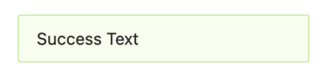

# Ant Design 101：从 Alert 开始

了解并学习UI组件库的设计思路和实现方法

**[Alert组件文档](https://ant.design/components/alert/)**。Alert 作为一个最简单的组件是一个很好的开始。



## 1. 项目结构


\_\_tests__：测试相关代码


## 2. 准备工作

1. **Index.tsx**

   Alert组件仅有 index.tsx 一个文件：<u>组件实现</u>和<u>导出</u>均在此文件中完成。

2. **import 部分**

   ```typescript
   import * as React from 'react';
   // icons
   import CloseOutlined from '@ant-design/icons/CloseOutlined';
   ...
   import CloseCircleFilled from '@ant-design/icons/CloseCircleFilled';
   // 动画库
   import Animate from 'rc-animate';
   // 用于动态渲染classname的库
   import classNames from 'classnames';
   // use context
   import { ConfigContext } from '../config-provider';
   import getDataOrAriaProps from '../_util/getDataOrAriaProps';
   import ErrorBoundary from './ErrorBoundary';
   import { replaceElement } from '../_util/reactNode';
   ```

   首先是引入 React ，各种图标，动画库和一个第三方工具库`classnames`；其他的引入会在下文讨论和说明。

3. **定义 Props 结构**

   ```typescript {17,18,19,20,23,24,25}
   export interface AlertProps {
     type?: 'success' | 'info' | 'warning' | 'error';
     closable?: boolean;
     /** Close text to show */
     closeText?: React.ReactNode;
     /** Content of Alert */
     message: React.ReactNode;
     /** Additional content of Alert */
     description?: React.ReactNode;
     /** Callback when close Alert */
     onClose?: React.MouseEventHandler<HTMLButtonElement>;
     /** Trigger when animation ending of Alert */
     afterClose?: () => void;
     /** Whether to show icon */
     showIcon?: boolean;
     /**  */
     role?: string;
     style?: React.CSSProperties;
     prefixCls?: string;
     className?: string;
     banner?: boolean;
     icon?: React.ReactNode;
     onMouseEnter?: React.MouseEventHandler<HTMLDivElement>;
     onMouseLeave?: React.MouseEventHandler<HTMLDivElement>;
     onClick?: React.MouseEventHandler<HTMLDivElement>;
   }
   ```

   Props 内部所有的值所代表的意思很直白，这里不再挨个讨论。不过在看 Props 结构的时候请参考 **[Alert API](https://ant.design/components/alert/#API)**，方便理解。接下来说一下在文档中没有出现的几个值：

   1. **style, className**：自定义的行内样式和类名
   2. **onMouseEnter, onMouseLeave, onClick**：几个事件钩子
   3. **prefixCls**：类名前缀。在 AntDesign 中，类名前缀默认为 ant-*.
   4. **role**：根据 [ARIA](https://www.w3.org/TR/2014/REC-html5-20141028/dom.html#aria-role-attribute)，HTML元素应该标明自己所属的角色（功能）。例如：`<hr/>` 提供 `separator (分割)` 的功能
   
4. **定义 Alert 函数组件并挂载 ErrorBoundary 组件**

   这里出现了 `ErrorBoundary` 组件，其在开头被引入。它的作用可以参考 **[Alert ErrorBoundary 文档](https://ant.design/components/alert/#Alert.ErrorBoundary)**。
   
   ```typescript
   import ErrorBoundary from './ErrorBoundary';
   /* ... */
   interface AlertInterface extends React.FC<AlertProps> {
     ErrorBoundary: typeof ErrorBoundary;
   }
   const Alert: AlertInterface;
   /* ... */
   Alert.ErrorBoundary = ErrorBoundary;
   ```
   
   这里定义了 `AlterInterface` 接口并继承自 `React.FC<AlterProps>`。其作用是将 `ErrorBoundary` 挂载到 Alert 函数组件上。
   
   ```jsx
   // 引入
   const { ErrorBoundary } = Alert;
   // 使用
   <ErrorBoundary>
     <children />
   </ErrorBoundary>
   ```
   
5. **State HOOK**

   ```typescript
   /** 关闭状态：正在关闭 | 已关闭 */
   const [closing, setClosing] = React.useState(false);
   const [closed, setClosed] = React.useState(false);
   ```

6. **Ref HOOK & 挂载元素**

   ```tsx
   // 创建一个 HTML元素 的 ref
   const ref = React.useRef<HTMLElement>();
   // 挂载在元素
   <div ref={ref} ...></div>
   ```

7. **获取 ConfigProvider 分发的配置项**

   ```typescript
   const { getPrefixCls, direction } = React.useContext(ConfigContext);
   // prefixCls 在没有自定义前缀时，默认值为 ant-* 即 ant-alert.
   const prefixCls = getPrefixCls('alert', customizePrefixCls);
   // 获取 direction，并判断是否需要添加 ant-alert-rtl 类
   const alertCls = classNames({
     [`${prefixCls}-rtl`]: direction === 'rtl',
     ...other
   })
   ```

## 3. 组件逻辑

上个部分介绍了准备一些准备工作，包括引入的包，组件数据定义，组件内部状态的定义和配置项的获取。下面从组件逻辑的角度来继续讨论 Alert 的实现。

```tsx {3,9}
// 当 closed 为真时，不渲染。
return closed ? null : (
  <Animate
    component=""
    showProp="data-show"
    transitionName={`${prefixCls}-slide-up`}
    onEnd={animationEnd}
    >
    <div>
    	...
    </div>
  </Animate>
);
```

1. **\<Animate>\</Animate>**

   Animate 组件见使用文档 [Npm Animate](https://www.npmjs.com/package/rc-animate)。

   `transitionName` 描述了过渡动画的名字，这里为 ``${prefixCls}-slide-up``。

   `onEnd` 在动画结束时调用，此处调用了 `animationEnd` 方法：设置 Alert 状态为**已关闭**，并调用通过 `Props` 传入的 `afterClose`。

   ```typescript
   const animationEnd = () => {
     setClosing(false);
     setClosed(true);
     afterClose?.();
   };
   ```

2. **组件**

   ```tsx
   <div
     ref={ref}
     data-show={!closing}
     className={alertCls}
     style={style}
     onMouseEnter={onMouseEnter}
     onMouseLeave={onMouseLeave}
     onClick={onClick}
     role="alert"
     {...dataOrAriaProps}
     >
     {isShowIcon ? renderIconNode() : null}
     <span className={`${prefixCls}-message`}>{message}</span>
     <span className={`${prefixCls}-description`}>{description}</span>
     {renderCloseIcon()}
   </div>
   ```

   `{...dataOrAriaProps}` 通过 `getDataOrAriaProps` 将 props 中与 `data-*` , `role`, `aria-*` 和 `data-__` 有关的值加载到 div 中。
   
   ```typescript
   const dataOrAriaProps = getDataOrAriaProps(props);
   ```
   
   回到组件，其内部实现很简单。这里附上组件的使用方法，通过对照就可以理解各个部分的作用。
   
   ```tsx
   <Alert
     message="Warning"
     description="This is a warning notice about copywriting."
     type="warning"
     showIcon
     closable
   />
   ```
   
   
   
   在这里讨论一下有关于 Alert 组件的几个功能：横幅模式，显示图标，可关闭和关闭信息：
   
   1. **横幅模式（Banner）**
   
      在默认情况下 Alert 组件不会被固定在屏幕顶部。在设置 banner 后，Alert 会被固定在顶部且其宽度为整个文档的宽度。
   
      通过 banner 来判断是否将 `ant-alert-banner` 添加到 class 中。
   
      ```tsx
      const alertCls = classNames({
        // !!banner 将所有值都转换为布尔型
        [`${prefixCls}-banner`]: !!banner,
        ...otherClassName
      });
      ```
   
      > Props 的默认值为 true。 [深入 JSX](https://zh-hans.reactjs.org/docs/jsx-in-depth.html#props-default-to-true)
   
      此外，Alert 在判断 type 的时候也会参考是否存在 banner。如下：
   
      ```typescript
      // 当既不规定 type 也不规定 banner 时，Alert type 默认值为 info
      const getType = () => {
        const { type } = props;
        if (type !== undefined) {
          return type;
        }
        return props.banner ? 'warning' : 'info';
      };
      ```
   
   2. **显示图标**
   
      ```tsx {7}
      const renderIconNode = () => {
        const { icon } = props;
        // 使用不同类型的图标
        const iconType = (props.description ? iconMapOutlined : iconMapFilled)[type] || null;
        if (icon) {
          return replaceElement(icon, <span className={`${prefixCls}-icon`}>{icon}</span>, () => (
              {
                className: classNames(`${prefixCls}-icon`, {
                  [(icon as any).props.className]: (icon as any).props.className,
                }),
              }
            ));
        }
        return React.createElement(iconType, { className: `${prefixCls}-icon` });
      };
      ```
      
      [React.cloneElement](https://zh-hans.reactjs.org/docs/react-api.html#cloneelement)
      
      [掘金 React.cloneElement 的作用](https://juejin.im/post/6844903983975235592)
      
      这里最主要的功能是将传入的 icon 元素的 props 与新的 props（replaceElemnt 的第三个参数）进行合并并返回clone。主要是为传入的 icon 添加新的 classname。
      
      
   

