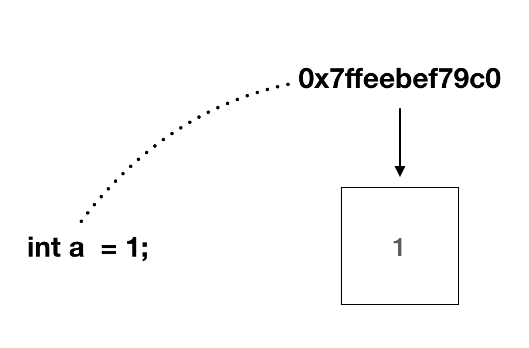
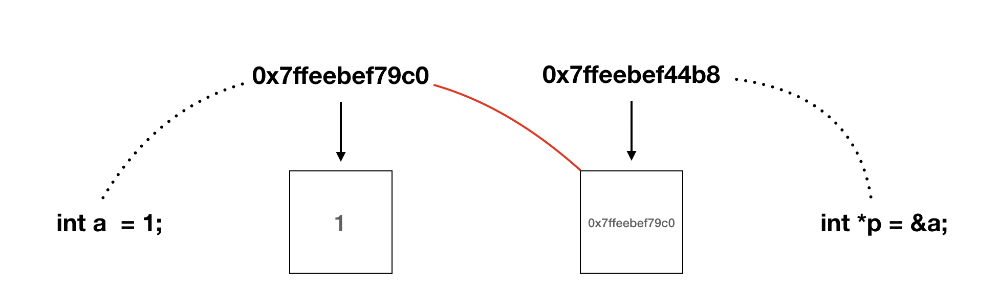
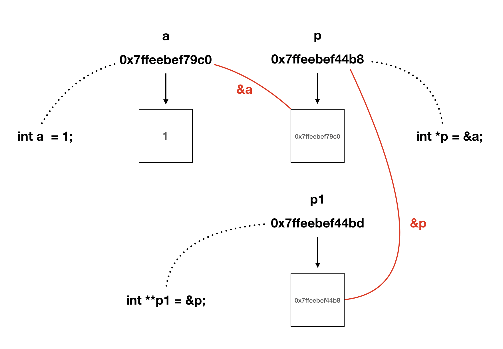
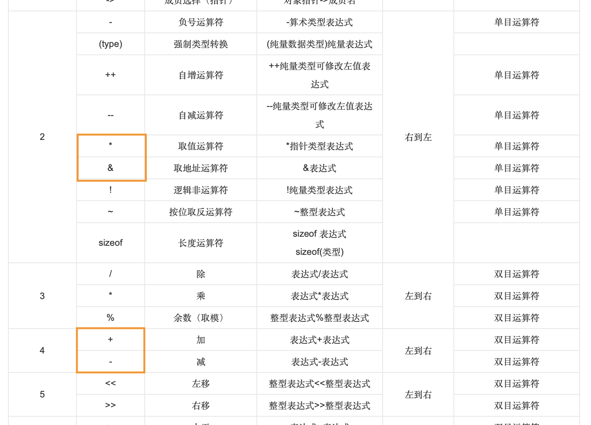
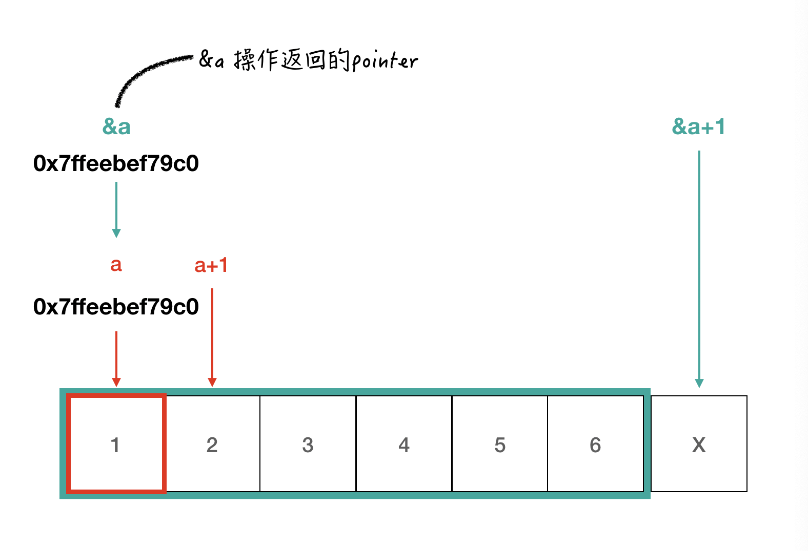
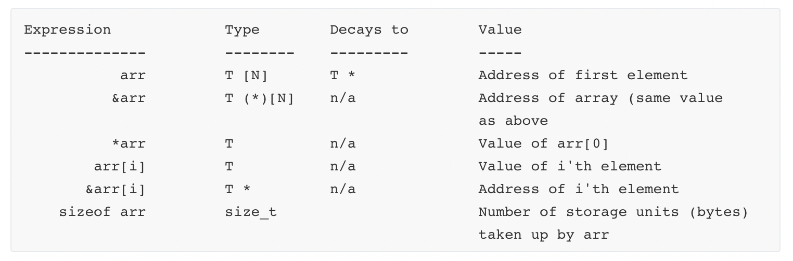
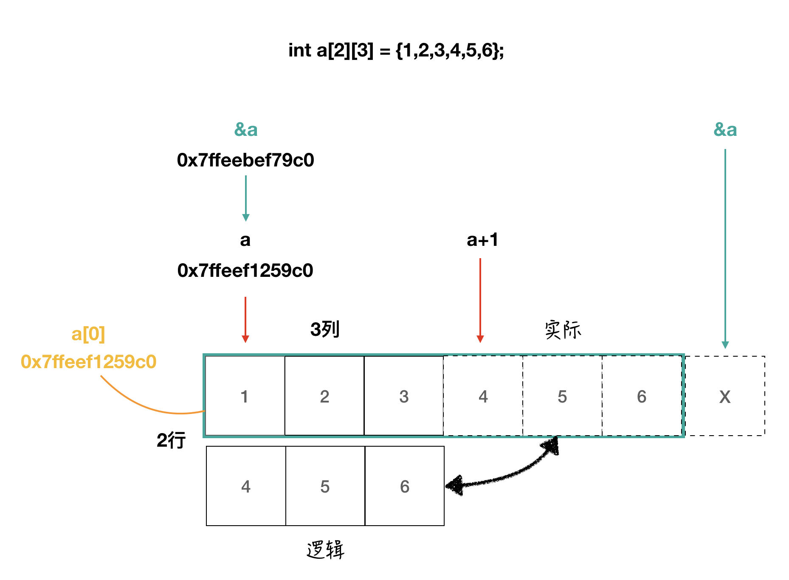
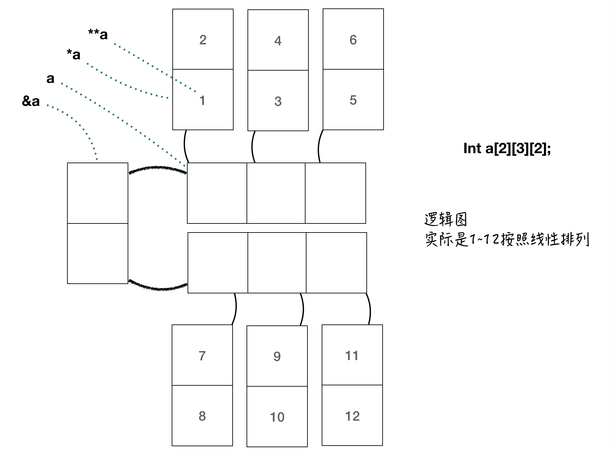

#### 本篇通过几个实验来讨论关于指针的问题

1. 指针是什么？
2. 指针相关的运算符。
3. 一维数组和指针。
4. ...
   <!--more-->

# C 语言中关于指针的个人总结

在复习 C 语言的过程中，遇到了二维数组的指针表示问题。因此凭借这次机会查阅了相关的资料并进行了部分的代码实验。本篇即是一次个人总结。

### 0x00 指针与地址

我们知道，在计算机内存中所有的数据均是线性排布。每个单元都有其唯一的地址与之对应，我们可以理解为一条街所有的房子都有唯一的门牌号。而指针就是门牌号，我们可以通过指针找到内存中任意单元内的值，就好比我们可以通过门牌号找到任意一栋房子。

而在这里，我们需要额外注意的是变量名在程序中的作用。



**_如上图所示，变量名只是为了程序员方便地编写程序而存在。实际上，在后续的操作中，编译器会去除所有的变量名而将其替换为内存地址。_**这一点非常重要。

在 C 语言中，我们知道存在数据类型，例如：int 代表整数，即该变量存放一个整数，这很好理解。

```Cpp
int a = 10;
printf("%d", a);
// 输出：10
```

而对于指针来说，指针变量存放的就是地址。一个指向别的变量的地址

```C
int *p = &a;
printf("%p", p);
// 输出：0x7ffeec54c988 变量 a 的地址。我们可以通过这个地址找到 a
```

对于上述的程序，我们可以用下图来形象表示它：



而关于 \* 和 & 会在下面进行讨论。

### 0x01 运算符 \* 与 &

这是两个与指针关系密切的运算符。

1. \* 指针符：

   顾名思义，指针符即和指针有关，在这里我们讨论两种见到该运算符的情况：

   ```C
   int *p;
   ```

   该种意为，申明一个**整数型变量指针**，它负责指向整形变量。同理其他类型的变量也有其对应的指针。

   ```C
   printf("%d", *p);
   ```

   该种意为，取指针所指地址所表示的值。具体可看下面的程序样例

   ```C
   #include <stdio.h>
   int main(void) {
       int a = 10;			// 声明 int 变量 a
     	int *p = &a;		// 声明 int 型指针 p，并将 a 的地址赋予 p
     	printf("%d", *p);	// 打印 p 所指的变量的值
       return 0;
   }

   // 输出：10
   ```

   而如果我们再多加一个指向 p 指针的指针。我们可以继续试验看看结果如何：

   ```C
   #include <stdio.h>
   int main(void) {
       int a = 10;
       int *p = &a;
       int **p1 = &p;
       printf("%p, %p", p1, &p);
       return 0;
   }

   // 输出：0x7ffeef1909c0, 0x7ffeef1909c0
   // 可见两个地址是一样的。我们打印了p1的值，同时我们也打印了 p 自身的地址。
   ```

   我们可以用下面这幅图来说明上述例子，请注意内存单元内的数值，这将有助于我们了解内在的工作机制。

   

2. & 取地址符：

   顾名思义，该运算符就是取所操作变量的自身地址。在上面的几个例子中，我们也使用了它。

3. 运算优先级：

   这是一个很容易忽视的问题，在许多题目中 \* & + 和变量名同时出现，会对我们造成困扰。但如果我们按照规定优先级进行运算，这将不是问题。优先级可以查看下面这张图。
   

   很明显可以发现 _ 和 & 的操作优先级明显高于 +。而 _ & 在一起出现时，也是按照右到左的顺序执行。我们可以举一个简单的例子来说明这个问题.

   ```c
   #include <stdio.h>
   int main() {
     int a[6] = {1,2,3,4,5,6};
     int *p = a;
     printf("%p\n", a);
     printf("%p, %d, %d, %p", p+1, *p+1, *(p+1), &*(p+1));
     return 0;
   }

   // 输出 0x7ffeeed359b0
   // 输出 0x7ffeeed359b4, 2, 2, 0x7ffeeed359b4
   // 第一行输出是 a 的首地址，作为参考
   ```

   **程序中第二行输出从左到右依次是：p 指针偏移一个 int 型单元后的地址，p 指针所指数组首地址的值(1)再加 1 的结果，p 指针偏移一个 int 单元后所指的值，p 指针偏移一个内存单元后所指的值的地址。**

   上述结果为我们说明了一个现象，即：对于指针的 **_加减_** 操作，均是对地址 **_偏移_** 若干个类型字节量。(eg: int 4 字节)

### 0x02 一维数组中的指针

在上面的程序实例中，我们首次使用到了一维数组。一维数组顾名思义就是只有一个维度的数组，它与计算机线性内存模型的一致也让我们能更加方便的了解指针和一维数组的关系。

1. 特殊的变量名

   前文说过，我们程序中所有的变量名都会被最终替换成对应的地址，在程序中也可以通过直接访问变量名，也就是地址，来访问存储的值。因此，我们也可以通过数组变量名来访问数组元素。

   下面这个例子将展示，数组的变量名：

   ```c
   #include <stdio.h>
   int main() {
     int a[6] = {1,2,3,4,5,6};
     int *p = a;
     printf("%p\n", a);
     return 0;
   }

   // 输出: 0x7ffee52449c0
   ```

   可以发现，这个程序中通过输出 a，数组变量名，直接输出了它的内存地址。这与先前的其他变量都不一样（如整形变量名）。

   ```c
   int a[6] = {1,2,3,4,5,6};
   int b = 10;
   printf("%p\n", a);
   printf("%p\n", b);
   // 上述程序会输出不正常结果。说明我们无法通过 b 直接输出它的地址。
   ```

   这说明，a 值就是一个地址。

   > 数组名是一个地址，某种意义上等价于指针。而不是指针变量。

   很多情况下，我们喜欢将数组名看做指针，实际上这是不正确的。

2. 内在机制

   我们通过上述的反常现象进行实验。如下代码所示：

   ```c
   #include <stdio.h>
   int main() {
     int a[6] = {1,2,3,4,5,6};
     printf("%p, %p\n", a, a+1);
     printf("%p, %p\n", &a, &a+1);
   }

   /*
   输出:
   0x7ffeeb7cb9c0, 0x7ffeeb7cb9c4
   0x7ffeeb7cb9c0, 0x7ffeeb7cb9d8
   */
   ```

   通过上述打印 a 本身和 a 的本身的地址，我们发现这是两个一样的地址。更有趣的是，通过对 a 进行一位偏移，a+1 的地址变成了 …c4 正好与 …c0 多了 4 字节（1 个 int 型）；而 &a 的地址虽然开始时与 a 相同，但进行一位偏移，&a+1 的地址变成了 …d8 正好与 …c0 多了 24 字节（6 个 int 型）。

   > 在 C 中， 在几乎所有使用数组的表达式中，数组名的值是个指针常量，也就是数组第一个元素的地址。 它的类型取决于数组元素的类型： 如果它们是 int 类型，那么数组名的类型就是“指向 int 的常量指针“。
   >
   > ——《C 和指针》 P141

   > 在以下两中场合下，数组名并不是用指针常量来表示，就是当数组名作为 sizeof 操作符和单目操作符&的操作数时。 sizeof 返回整个数组的长度，而不是指向数组的指针的长度。 取一个数组名的地址所产生的是一个指向数组的指针，而不是一个指向某个指针常量的指针。 所以&a 后返回的指针便是指向数组的指针，跟 a（一个指向 a[0]的指针）在指针的类型上是有区别的。
   >
   > ——《C 和指针》P142

   因此，结合上面两段话我们可以有如下总结：

   实际上数组名只在两种情况下**_不能_**作为指向数组第一位的指针

   1. Sizeof(数组名)

      ```c
      #include <stdio.h>
      int main() {
        int a[3] = {1,2,3};
        int *p = a;
        printf("%lu, %lu", sizeof p, sizeof a);
        return 0;
      }
      // 输出： 8, 12
      ```

      可见此时输出的是整个数组的大小。而不是 指针 的大小 8 字节。

   2. &数组名

      通过上面的程序例子中，我们发现 a, a+1 和 &a, &a+1 的表现是不一致的。这是因为，&a 返回的是一个指向整个数组的指针，**而不是我们之前所理解的返回自身的地址**。下面这个例子可以说明这个问题:

      ```C
      #include <stdio.h>
      int main() {
        int a[3] = {1,2,3};
        int (*p)[3] = &a;
        printf("%lu, %lu", sizeof *p, sizeof p);
        return 0;
      }
      // 输出 12, 8
      ```

      Int (\*p)[3] 是我们第一次见，此项可以理解为是一个指向**长度为 3 个 int 型的连续空间**的指针。下图可以表示这些关系。

      

      那么，之前我们在程序中发现的异常现象也就解释清楚了。

      在这里再贴出一个数组与指针关系的表格。供大家参考：

      

      如果读者还有兴趣继续研究，我在这里贴几个网站作为参考。

      > [When to use \* in pointer assignment?](https://stackoverflow.com/questions/37139112/when-to-use-in-pointer-assignment)
      >
      > [C 中，数组名和指针有区别吗？](https://www.zhihu.com/question/41805285/answer/92606735)

### 0x03 二维数组中的指针

二维数组实际上与一维数组无异。只是将若干个一维数组组合起来存放在内存中。

1. 二维数组的逻辑格式：

   如下图所示，附图一张供大家参考.

   

2. 二维数组中需要注意的指针问题。

   ```c
   int *p = *a; // a[0] 也是可以的
   int (*p1)[3] = a;
   int (*p2)[2][3] = &a;
   ```

   通过之前的铺垫，这里给出的 3 个表达式就可以理解了。

### 0x04 三维数组中的指针

三维数组即更高维度的数组我们可以通过画图来帮助理解。



```c
#include <stdio.h>
int main() {
  int a[2][3][2] = {1,2,3,4,5,6,7,8,9,10,11,12};
  int *p = **a;
  int (*p1)[2] = *a;
  int (*p2)[3][2] = a;
  int (*p3)[2][3][2] = &a;
  return 0;
}
// 以上都是正确的声明
```
