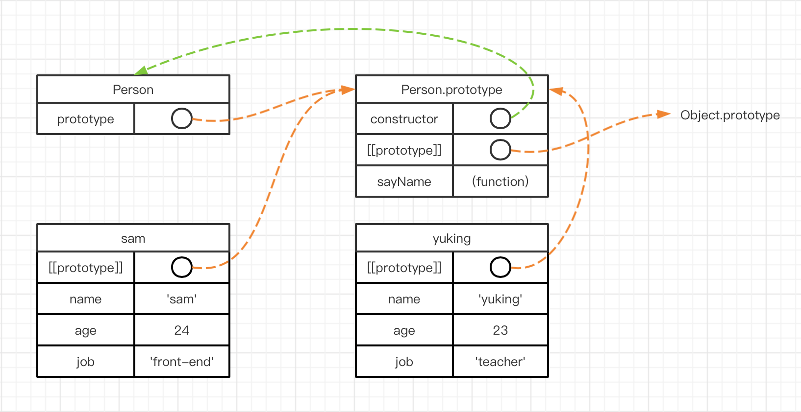
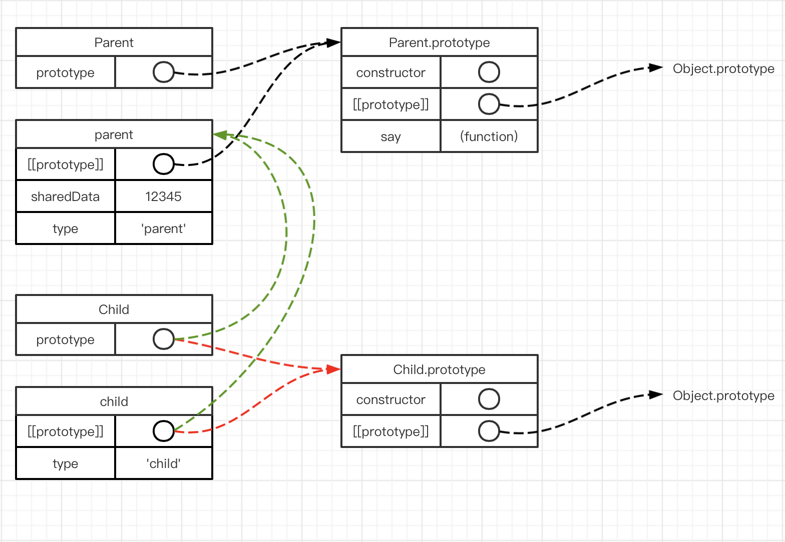

# JavaScript 101: Prototype Chain

In JavaScript, prototype chain is one of the more important points to know. It implements implementation inheritance for JavaScript. (JavaScript does not have function signatures and therefore cannot implement interface inheritance)

## Prototypes of functions and prototype chains

> A prototype chain is a series of objects (instances) strung together.

Whenever a function is created, a **prototype object** is automatically added to it, which is called the prototype of the function. For example

```javascript
function Test() {
  /* test */
}
console.log(Test.prototype) // {constructor: ƒ}
```

And the prototype object will have a **constructor** property, which in turn points to the function. The other properties of the prototype object are inherited from Object.

```javascript
console.log(Test.prototype.__proto__)
/* 
{constructor: ƒ, __defineGetter__: ƒ, __defineSetter__: ƒ, hasOwnProperty: ƒ, __lookupGetter__: ƒ, ...}
*/
```

It can be found that it is still a **prototype object** and can be known that the object was **automatically generated** by the Object() function. This forms a chain.

> This pointer is called a [[Prototype]] in ECMA-262 version 5. Although there is no standard way to access `[[Prototype]]` in scripts, Firefox, Safari, and Chrome support a property `__proto__` on each object. This connection exists between the instance and the constructor's prototype object, not between the instance and the constructor.
>
> -- Advanced Programming in JavaScript, 3rd Edition

In summary, let's clarify some concepts.

1. `prototype`: is a property of a function that points to the corresponding prototype **object**.
2. `[[prototype]]`: the ECMA-262 standard, whose role**is to act as a pointer inside an object (instance) to the prototype object** of **its** constructor**.
3. `__proto__`: Browser or JavaScript runtime environment specific implementation of `[[ prototype ]]`.

Somewhat in a roundabout way, we can give a few examples 🌰.

```javascript
function Person (name, age, job) {
  this.name = name;
  this.age = age;
  this.job = job
}
Person.prototype.sayName = function () {
  console.log(this.name);
}
const PersonPrototype = Person.prototype;

// output PersonPrototype.
PersonPrototype // {constructor: ƒ}

// typeof can determine that the type is indeed an object
typeof PersonPrototype // "object"

// instantiate a person object
const sam = new Person('sam', 24, 'front-end developer');
// objects don't have prototype attributes, only [[prototype]] implementations of __proto__
sam.__proto__ === PersonPrototype // true
sam.prototype // undefined
// instantiate a person object
const yuking = new Person('yukong wang', 23, 'teacher');
```

**<u>This diagram is very important</u> 🚀**



Another point worth noting. Due to the nature of JavaScript data types, some reference types like functions, objects, and so on are shared by all instances when they are mounted on a prototype object. Sometimes it is necessary to be aware of such issues that may lead to accidental modification of other instances' data.

## Inheritance

The biggest role of inheritance is to increase the reuse of code. Subclasses can directly access the properties and methods of the parent class, which are shared by the child parent.

Using prototype chains, we can implement this reuse in JavaScript as well. As an example 🌰 let's say.

```javascript
function Parent () {
  this.type = "father";
  this.sharedData = 12345;
}
Parent.prototype.say = function () {
  console.log(`${this.type}: ${this.sharedData}`);
};

function Child () {
  this.type = "child";
}

const parent = new Parent(),
      child = new Child();
```

Now, how do you make an instance of Child also use the `sharedData` and `say` methods of Parent? Before we explain how, we also need to discuss how JavaScript <u>***finds properties and methods of the instance object***</u>.

* Step 1: First look on the object itself to see if it has the property, and if so, return the result
* Step 2: If not, go to the object's prototype to find out, if so, return the result
* **Step 3: If not, continue to look up the prototype chain until the prototype of Object.prototype can be, if there is, return the results**
* Step 4: If there is no prototype on Object.prototype either, return undefined

The key is Step3, because if we want to call the `say()` method of `child`, we won't find it in `child` and `Child.prototype`, because we don't define it at all. Since we need to go up the list, who should we look for?

Thinking back to the `parent` instance, if we access `sharedData` on `parent` or call the `say()` method. First JavaScript will look on the parent instance and find `sharedData`; however, `say()` still needs to go to the parent's prototype object to find it.

Since this is the case, we might as well point the `child` object directly at the `parent` instance, so that the two different instances can be connected by this internal pointer.

```javascript
child.__proto__ = parent;
console.log(child.say()) // child: 12345
```

As you can see, we have implemented the original idea. And because of JavaScript's mechanism for finding properties: `type` is still the value of the `child` instance itself. But it's too annoying to manually change the internal pointer (`__proto__` or `[[prototype]]`) of all instances to point to another object instance every time, so it's better to just write it as

```javascript
Child.prototype = new Parent();
```

At the end, it is important to repeat that

`__proto__` and `prototype` refer to the same thing, a **prototype object**. The difference is that `__proto__` is a property of the instance, and `prototype` is a property of the function. The reason for avoiding using the name constructor throughout this article is to avoid causing confusion. A constructor is a function, no different.

Thus, the two ways of writing the above: one from the instance object perspective and one from the function perspective. But the purpose is the same, and that is to replace the original prototype object with an instance of `Parent`, `perent`.

**As shown in the figure: the green color is the pointer pointing after replacing the prototype object with an instance of parent.** The



**I've been thinking about this image three times a day**


## How to use the prototype chain

1. `new`

   This operator typically goes through the following 4 steps when creating an object.

   ```javascript
   // Suppose the constructor is Person();
   function new (Constructor) {
     // Create a temporary object
     let temp = {};
     // point the prototype of the temporary object to the constructor's prototype object
     temp.__proto__ = Constructor.prototype;
     // set the temporary object to this in the constructor and execute the constructor
     Constructor.call(temp);
     // return the temporary variable
     return temp;
   }
   ```

2. ``instanceof`''

   ```javascript
   function instanceof(left, right) {
     const rightVal = right.prototype;
     const leftVal = left.__proto__;
     while(true) {
       if (leftVal === null) {
         // Found the head
         return false;
       }
       if (leftVal === rightVal) {
         // A consistent prototype object was found
         return true;
       }
      // Replace the prototype object with the one above the instance object
       leftVal = leftVal.__proto__;
     }
   }
   ```

3. ``Object.prototype.hasOwnProperty()`

   This method is used to determine if the object owns a certain property, not found in the prototype chain.

   ```javascript
   Object.prototype.hasOwnProperty = function (property) {
     // Make a deep copy, breaking its association with the prototype function.
     const obj = JSON.parse(JSON.stringify(this));
     return ! !obj[property];
   }
   ```

4. ``Object.prototype.isPrototypeOf()`

   This method is used to determine if an object is a prototype of an object: check if an object exists in the prototype chain of another object

   ```javascript
   // is object1 a prototype of Object2, that is, Object2 is a prototype of Object1,,if so, return true, otherwise false
   object1.isPrototypeOf(Object2);
   ````.

5. **TODO:** `in` or more applications related to prototype chain.
