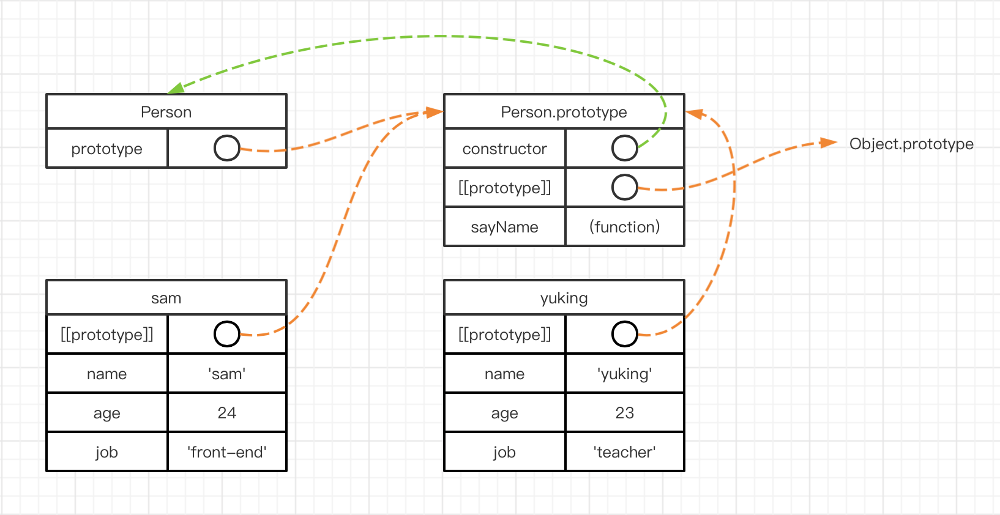
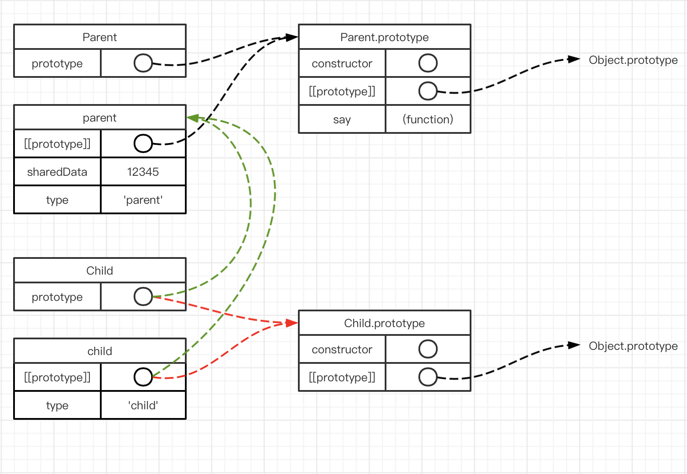

# JavaScript 101: 原型链

在 JavaScript 中，原型链是一个比较重要的知识点。其为 JavaScript 实现了实现继承。（ JavaScript 不存在函数签名，因此不能实现接口继承 ）

## 函数的原型与原型链

> 原型链是由一系列对象（实例）串起来的。

每当创建一个函数的时，都会为其自动添加一个**原型对象**，被称为该函数的原型。例如

```javascript
function Test() {
  /* test */
}
console.log(Test.prototype) // {constructor: ƒ}
```

并且其原型对象会有一个 **constructor** 属性，其又指向了该函数。而该原型对象的其他属性都是继承自 Object。

```javascript
console.log(Test.prototype.__proto__)
/* 
{constructor: ƒ, __defineGetter__: ƒ, __defineSetter__: ƒ, hasOwnProperty: ƒ, __lookupGetter__: ƒ, …}
*/
```

可以发现，其还是一个**原型对象**并且可以知道该对象是**由 Object() 函数自动生成**。这就形成了一个链。

> ECMA-262 第 5 版中管这个指针叫[[Prototype]]。虽然在脚本中 没有标准的方式访问 `[[Prototype]]` ， 但 Firefox、Safari 和 Chrome 在每个对象上都支持一个属性 `__proto__`。这个连接存在于实例与构造函数的原型对象之间，而不是存在于实例与构造函数之间。
>
> —— JavaScript 高级程序设计 第三版

综上，我们要明确一些概念：

1. `prototype`：是函数的一个属性，其指向对应的原型**对象**。
2. `[[prototype]]`：ECMA-262 的标准，其作用**是**在一个对象（实例）内部作为**一个指针指向**其**构造函数的原型对象**。
3. `__proto__`：浏览器或者 JavaScript 运行环境针对 `[[ prototype ]]` 的具体实现。

有些绕，我们可以举几个例子🌰：

```javascript
function Person (name, age, job) {
  this.name = name;
  this.age = age;
  this.job = job
}
Person.prototype.sayName = function () {
  console.log(this.name);
}
const PersonPrototype = Person.prototype;

// 输出 PersonPrototype.
PersonPrototype // {constructor: ƒ}

// typeof 可以判断其类型确实是对象
typeof PersonPrototype // "object"

// 实例化一个 person 对象
const sam = new Person('sam', 24, 'front-end developer');
// 对象是没有 prototype 属性的，只有 [[prototype]] 的实现 __proto__
sam.__proto__ === PersonPrototype // true
sam.prototype //undefined
// 实例化一个 person 对象
const yuking = new Person('yukong wang', 23, 'teacher');
```

**<u>这个图非常重要</u> 🚀**



另一个值得注意的一点。由于 JavaScript 数据类型的特点，类似于函数，对象，等一些引用类型，当他们挂载在原型对象上时，会被所有实例共享。有时候需要注意这种可能会导致意外修改其他实例数据的问题。


## 继承

继承最大的作用在于增加代码的复用，子类可以直接获取父类的属性和方法，这些方法和属性是由子类父类共同使用的。

利用原型链，我们也可以在 JavaScript 中实现这种复用。举个例子🌰吧：

```javascript
function Parent () {
  this.type = "father";
  this.sharedData = 12345;
}
Parent.prototype.say = function () {
  console.log(`${this.type}: ${this.sharedData}`);
};

function Child () {
  this.type = "child";
}

const parent = new Parent(),
      child = new Child();
```

现在，如何让 Child 的实例也可以使用 Parent 的 `sharedData` 和 `say` 方法呢？在说明方法之前，还需要讨论一下 JavaScript 是<u>***如何寻找实例对象的属性和方法***</u>的。

* Step 1: 首先在对象自身上查找是否有该属性，如果有，返回结果
* Step 2: 如果没有，就去对象的原型上进行查找， 如果有，返回结果
* **Step 3: 如果没有，就沿着原型链继续往上查找，直到Object.prototype原型上即可,如果有，返回结果**
* Step 4: 如果Object.prototype原型上也没有，返回undefined

由此可见，关键在 Step3。因为如果我们想要调用 `child` 的 `say()` 方法，在 `child` 和  `Child.prototype` 这里是肯定找不到的，因为我们根本没有定义这个方法。既然我们需要接着向上找，那该找谁？

回想到 `parent` 实例，如果我们在  `parent` 上访问 `sharedData` 或者调用 `say()` 方法。首先 JavaScript 会在 parent 实例上找，会找到  `sharedData` ；不过  `say()` 还是需要到 Parent 的原型对象上才能找到。

既然如此，我们不如将 `child` 的对象直接指向 `parent` 实例，这样就可以通过这个内部的指针来连接两个不同的实例。

```javascript
child.__proto__ = parent;
console.log(child.say()) // child: 12345
```

可以发现，我们实现了原来的构想。而且因为 JavaScript 查找属性的机制：`type` 仍然是 `child` 实例自己的值。不过每次都需要手动更改所有实例的内部指针（`__proto__` 或者说 `[[prototype]]`）指向另一个对象实例太麻烦，不如直接写成：

```javascript
Child.prototype = new Parent();
```

在最后，还是要重复强调：

`__proto__` 和 `prototype` 指向的是一个东西，是**原型对象**。区别在于 `__proto__`  是实例的属性， `prototype` 是函数的属性。在这篇文章中，一直避免使用构造函数这个称呼，是为了避免造成困扰。构造函数就是函数，没什么不同。

因此，上面的两种写法：一个出于实例对象角度，一个出于函数角度。但是目的都是一个，那就是把原有的原型对象替换为 `Parent` 的实例，`perent`。

**如图所示：绿色为更换原型对象为 parent 实例后的指针指向。**



**吾日三省此图**


## 如何运用原型链

1. `new`

   该操作符在创建对象的时候，通常会经历如下的 4 个步骤：

   ```javascript
   // 假设构造函数是 Person();
   function new (Constructor) {
     // 创建临时对象
     let temp = {};
     // 将临时对象的原型指向至构造函数的原型对象
     temp.__proto__ = Constructor.prototype;
     // 将临时对象设定为构造函数中的 this 并执行构造函数
     Constructor.call(temp);
     // 返回临时变量
     return temp;
   }
   ```

2. `instanceof`

   ```javascript
   function instanceof(left, right) {
     const rightVal = right.prototype;
     const leftVal = left.__proto__;
     while(true) {
       if (leftVal === null) {
         // 找到头了
         return false;
       }
       if (leftVal === rightVal) {
         // 找到了一致的原型对象
         return true;
       }
   		 // 用实例对象上一层原型对象取代
       leftVal = leftVal.__proto__;
     }
   }
   ```

3. `Object.prototype.hasOwnProperty()`

   该方法用于判断对象是否拥有某种属性，而不是在原型链上找到。

   ```javascript
   Object.prototype.hasOwnProperty = function (property) {
     // 做一次深拷贝，断开其与原型函数的关联。
     const obj = JSON.parse(JSON.stringify(this));
     return !!obj[property];
   }
   ```

4. `Object.prototype.isPrototypeOf()`

   该方法用于判断对象是不是某个对象的原型对象：检查一个对像是否存在另一个对象的原型链上

   ```javascript
   //object1是不是Object2的原型,也就是说Object2是Object1的原型，,是则返回true,否则false
   object1.isPrototypeOf(Object2);
   ```

 5. **TODO：** `in` 或更多和原型链有关的应用。


